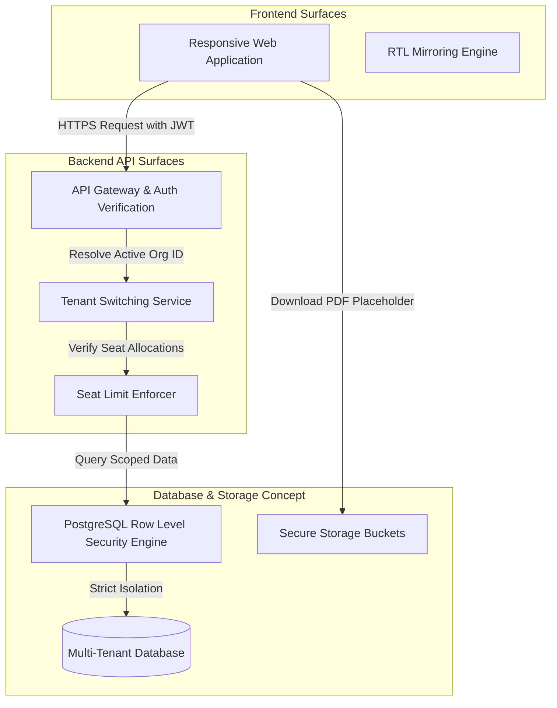

# 08 — Architecture: Team Subscription Manager

> **Status: Completed & Fully Filled Documentation Reference**

This document specifies the conceptual architectural blueprint for the Team Subscription Manager.

> [!WARNING]
> **DOCUMENTATION-ONLY ARCHITECTURE**: This represents a conceptual software design reference. No runnable application files, configuration scripts, database setups, or package structures are created.

---

## Conceptual Architecture Diagram

---

## Architectural Layers

### 1. Frontend Surfaces
- **Responsive Web SPA**: Recommended tech stack (Next.js/React or Vite/Vue). Designed to adapt fluidly from desktop sidebar layouts to mobile-responsive drawers.
- **RTL & Localization Mirroring**: Interface dynamically shifts layout direction utilizing HTML `dir` properties. CSS files use logical layout properties (e.g. `padding-inline-start`) to prevent layout breakages during switching.

### 2. Backend / API Surfaces
- **API Gateway & Session Context**: Handles token extraction (JWT). Translates user identities into session records.
- **Tenant Context Handler**: Intercepts requests, extracts the target `organization_id` header, and verifies that the active user possesses a corresponding record in the `OrganizationMembership` table.
- **Seat Limit Policy Service**: Performs transactional validation of membership counts when invitations are processed or accepted.

### 3. Database / Storage Concept
- **Multi-Tenant Schema**: Shared database instance. All tables (excluding global Lookups) contain a tenant partition key (`organization_id`).
- **PostgreSQL Row Level Security (RLS)**: Conceptual security rule enforcing that queries can only access rows matching `auth.jwt() -> organization_id`.
- **Storage Buckets**: Scoped storage paths for saving reports and mock invoice PDF files (e.g., `invoices/{organization_id}/{invoice_id}.pdf`).

### 4. Authentication and Authorization Concept
- **Identity Provider**: Supabase Auth or a similar provider manages passwords, emails, and global tokens.
- **RBAC Engine**: Custom query validation checks permissions based on organization role memberships.

### 5. Tenant Isolation Concept
- **Isolation Rules**: All SQL commands are executed with an active tenant parameter. Database connections use RLS by default.
- **Impersonation Auditing**: When a Support Admin initiates impersonation, an overriding security token is checked against active impersonation authorization tickets, generating system-level logging events.

### 6. Reporting and Export Concept
- **Report Generation**: Live seat usage metrics are combined with daily snapshot records (`SeatUsageSnapshot`).
- **CSV Data Assembly**: Staging datasets are formatted and converted to CSV payloads. Decimal values and dates are localized at the client layer before display.

### 7. PDF Placeholder Concept
- **PDF Generation**: Handled conceptually using clean web pages and browser print rendering. Explicit CSS page-break logic prevents layout clipping on multi-page invoices.

---

## Integration Boundaries

- **Mock Billing Gateway**: The subscription model maps plan names and limits conceptually. Direct connections to external billing APIs (e.g. Stripe webhooks) are excluded.
- **Third-Party Email Engine**: Mocked out. All email alerts (such as membership invites) generate local development log logs or database token outputs rather than invoking real SMTP servers.

---

## Related Files

- [07-data-model.md](07-data-model.md) — Underpinning schemas.
- [09-api-design.md](09-api-design.md) — API endpoint designs.
- [10-security-model.md](10-security-model.md) — Tenant isolation details.
