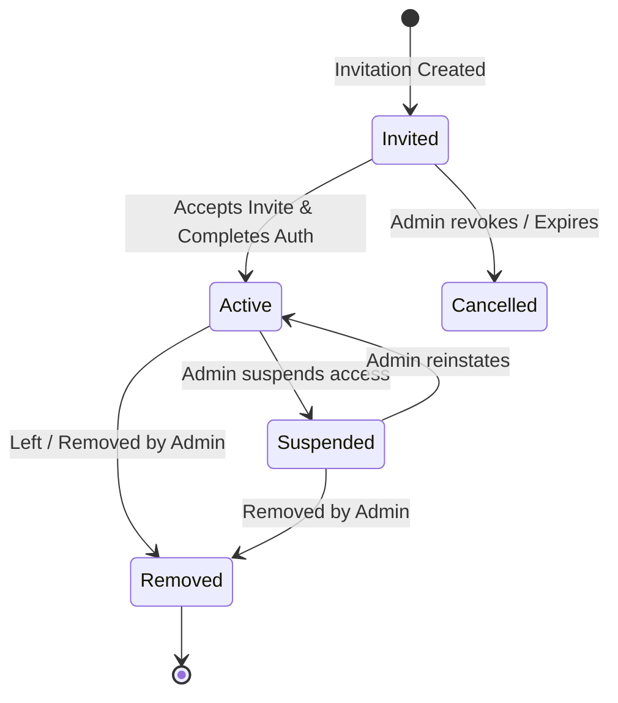

# Organization and Membership Guidelines

> Defines standards for designing team and organization structures, invitation workflows, user memberships, role assignments, default selection, and organization lifecycles.

---

## Purpose

Prevent membership orphans, unauthorized team joins, data leaks via incorrect invite acceptance, and administrative lockout by establishing strict logical constraints for organizations, memberships, invitations, and ownership transfers.

## Status

`Active` — Mandatory for all software architects, backend developers, and UX designers creating user onboarding, invitation, or settings modules.

---

## Organization Model Principles

1. **Decoupled Identity**: Membership is a tenant-level association, NOT the same as global authentication. A user's account must exist independently of any individual organization.
2. **Deterministic Invites**: Organization invitations must be cryptographically signed, single-use, and bound to specific emails or organization scopes.
3. **Continuous Ownership**: An organization must never be left without an active administrative Owner (continuity rule).
4. **Audited Changes**: Every change in membership state, invitation state, or role delegation must write a permanent entry to the audit logs.

---

## Workspace/Team Model Options

Depending on the complexity of the product, organizations can be structured under two main models:

- **Flat Organization Model (Default)**:
  - Users belong directly to the Organization.
  - Resources are scoped strictly to the `organization_id`.
  - Roles are assigned at the Organization level.
- **Nested Workspace Model**:
  - The Organization is the billing and umbrella administrative boundary.
  - Sub-teams or Projects are represented as **Workspaces** under the organization.
  - Users are added to the Organization first, then delegated to specific Workspaces.
  - *Scoping Rule*: All queries must scope on both `(organization_id, workspace_id)` to ensure nested boundaries are secure.

---

## Membership Lifecycle

A user's relationship to an organization follows a structured state transition model:

---

## Invitation Flow

To prevent unauthorized users from joining an organization:
- **Invite Creation**:
  - An Admin inputs an email and selects an initial role.
  - The system creates an `invitations` record containing: `id` (UUID), `organization_id`, `email`, `role`, `token` (cryptographically secure random string or JWT), `expires_at`, and `created_by` (User UUID).
- **Token Verification**:
  - The recipient clicks the invite link (containing the token).
  - The server verifies: token exists, token is not expired, token matches the target email, and the invitation has not been accepted yet.
- **Strict Scope Verification**:
  - **Invitation acceptance must be scoped to the correct organization.**
  - If the user accepts the invite while logged in with a different email, the system must warn them or block completion. Upon acceptance, create the `memberships` record and mark the invitation as `accepted`.

---

## Join/Leave/Removal Rules

- **Leaving an Organization**: A user can voluntarily leave an organization *unless* they are the sole Owner.
- **Administrative Removal**: Admins can remove members. Upon removal, the membership record state changes to `removed` or is deleted.
- **Account Implications**: **Removing a user from an organization must not delete the user account** unless explicitly designed (e.g., if the user was auto-provisioned strictly for that tenant and has no global identity). The user can still log in globally and access other organizations they belong to.

---

## Owner / Admin / Member / Viewer Roles

Standard organization tiers must map to the following permissions:
- **Owner**: Complete administrative control, billing ownership, ability to delete the organization, and transfer ownership. Max 1 per organization (or strict multi-owner rules).
- **Admin**: Full administrative control (invite members, modify settings, change roles) *except* billing subscription changes, organization deletion, and Owner role modification.
- **Member**: Standard read/write access to resources within the tenant. Cannot modify team memberships or organization settings.
- **Viewer**: Read-only access to scoped resources. Cannot create, edit, or delete data.

---

## Multi-Organization User Behavior

- **Independent Roles**: A user can be an Owner in Organization A, a Member in Organization B, and a Viewer in Organization C. The system must evaluate role authorization based strictly on the `memberships` entry of the *active* organization context.
- **No Role Spreading**: A role change in Organization A must have absolutely no effect on the user's role in Organization B.

---

## Default Organization Selection

- **First-Time Login Context**: When a user logs in, the application must resolve which organization context to load.
- **Resolution Strategy**:
  1. Load the `last_active_organization_id` stored on the user's global profile.
  2. If empty, load the first active membership found (sorted by `joined_at`).
  3. If the user belongs to no organizations, redirect them to an "Create or Join Organization" wizard flow.

---

## Account Deletion and Membership Implications

- **Membership Archival**: When a user requests deletion of their global account, the system must:
  - Check if they are the sole Owner of any active organization. If yes, block account deletion and require them to either transfer ownership or delete the organization first.
  - Delete or archive all `memberships` records associated with that user ID across all organizations.
- **Anonymization**: The user profile data can be hard-deleted or anonymized, but audit trails for membership actions (e.g., "User X invited User Y in 2025") must remain intact using immutable logs or anonymized identifiers.

---

## Transfer Ownership Rules

To prevent lockouts and maintain proper governance:
- ** continuity Rule**: **At least one owner/admin continuity rule must exist.** An Owner cannot downgrade their own role or leave the organization without first designating a new Owner.
- **Transfer Steps**:
  1. The current Owner selects an active Admin/Member to become the new Owner.
  2. The system upgrades the target user to `Owner`.
  3. The system downgrades the former Owner to `Admin` (or a regular member, as designed).
  4. **Ownership transfer must be audited.** Write an immutable audit log detailing the transaction.

---

## Audit Trail Requirements

The following membership events must write an immutable audit log entry containing: `event_name`, `timestamp`, `actor_user_id`, `target_user_id`, `organization_id`, and `metadata` (e.g., previous role and new role):
- `invitation.created` / `invitation.accepted` / `invitation.revoked`
- `membership.created` / `membership.removed` / `membership.suspended`
- `role.changed`
- `ownership.transferred`

---

## Out of Scope

- Specific UI mockups or routing layouts for settings panels.
- Specific database schema syntax for different platforms (Supabase RLS vs vanilla PostgreSQL schemas).

---

## Guardrails

- [ ] **NO SILENT ACCOUNTS**: A membership deletion must not silently purge a user's global profile if they belong to other tenants.
- [ ] **OWNERSHIP CONTINUITY**: Block any role downgrade or deletion action that would leave an active organization with zero Owners.
- [ ] **SCOPE-BOUND INVITES**: Restrict invitation tokens to a single use and verify the accepting email matching the token.

---

## QA Checklist

- [ ] Verify that a user can successfully accept an invite and that their membership is created under the correct organization boundary.
- [ ] Test the invitation flow when signed in as a different user; ensure the system blocks unauthorized acceptance.
- [ ] Attempt to delete or downgrade the sole Owner of an organization; verify the system blocks the action and displays an informative error.
- [ ] Verify that removing a user from Organization A does not affect their membership or data access in Organization B.
- [ ] Check audit logs after performing a role change and verify the actor, target, and org IDs are populated correctly.

---

## Related Core Files

- [04-user-roles.md](../../../core/docs/04-user-roles.md) — Standard user configurations and permissions.
- [05-user-flows.md](../../../core/docs/05-user-flows.md) — Onboarding and invitation user flows.
- [10-security-model.md](../../../core/docs/10-security-model.md) — Audit trail and authorization constraints.

---

## Change Log

| Date | Change | Author |
|------|--------|--------|
| 2026-05-29 | Initial creation of Organization and Membership Guidelines | Antigravity |
