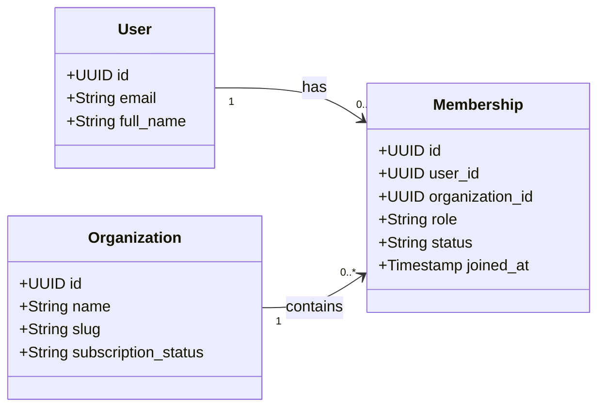

# SaaS Domain Model Guidelines

> Defines standards for designing database schemas, entity relationships, and core domain states in a multi-tenant SaaS application.

---

## Purpose

Establish clear, rigorous rules for structuring data in a multi-tenant environment. These guidelines prevent logical leaks, membership design flaws, and authorization defects by ensuring consistent boundaries between users, tenants, memberships, workspaces, and system-level entities.

## Status

`Active` — Mandatory for all software architects, database engineers, and backend developers designing database schemas or business domain entities for SaaS products.

---

## When to Use

Use these guidelines when the product:
- Serves multiple corporate entities, teams, or independent accounts (tenants).
- Permits users to belong to one or more organizations.
- Contains resources that must be strictly scoped to a specific tenant.
- Implements subscription plans that control feature flags or resource limits at the organization/tenant level.

---

## SaaS Domain Modeling Principles

1. **Clear Boundary Separation**: Draw a hard logical boundary between identity (authentication/users) and membership (authorization/tenancy).
2. **Explicit Tenancy Scoping**: Never assume tenancy is implicit. Every database entity must explicitly declare whether it is tenant-scoped or global.
3. **Database Scoping Integrity**: Scoping rules must be enforced in the persistence layer, never only in the presentation layer.
4. **Auditability**: Every change in membership state, billing state, or subscription bounds must be traceably recorded.

---

## Tenant vs. Organization vs. Workspace Definitions

To avoid naming confusion across different products, we establish three clear layers:
- **Tenant / Organization**: The primary logical and billing boundary. Usually represents a company, agency, or team account that pays for the subscription. All data, assets, and memberships are partitioned at this level.
- **Workspace**: An optional sub-divider within a single organization (e.g., projects, channels, or locations). Workspaces exist *under* an organization and cannot span multiple organizations.
- **System**: The global layer containing tenant-agnostic assets (e.g., global subscription plan templates, system logs, base permission definitions).

---

## User vs. Member Distinction

> [!IMPORTANT]
> **Identity is global; Membership is scoped.**
> Do not treat `user_id` and `tenant_id` as the same boundary.

- **User**: A globally unique physical person who can authenticate with the system. A user has email, password hash (handled by auth provider), profile information, and global configurations. A user is *not* intrinsically tied to a single tenant.
- **Member**: The specific intersection/relationship table between a **User** and an **Organization**. A member record holds tenant-scoped attributes: organization-level roles, joining date, invitation state, seat allotment, and status.

---

## Organization Membership Model

The canonical membership relationship must be modeled as a join table:

### Membership Lifecycle States
- **Invited**: An invitation has been sent but not accepted. The seat may or may not be reserved based on product-specific rules.
- **Active**: User has accepted the invite and has active access to the organization's data.
- **Suspended**: Access is temporarily blocked by an organization administrator (e.g., pending review).
- **Archived / Removed**: The relationship is terminated. The historical record remains for auditing purposes, but access is blocked.

---

## Multi-Organization User Pattern

A user must be able to belong to multiple organizations without duplicate user records:
- **Session Context**: At any given moment in the application, a user operates within the active context of a single selected organization.
- **Tenant Switching**: Switching organizations must swap the active `organization_id` in the user's session context and completely reset the client-side state/caches to prevent data cross-contamination.

---

## Tenant-Scoped Entity Rules

Any database table containing tenant data must explicitly include a tenant scope field:
- **Column Name**: Use a consistent name, preferably `organization_id` or `tenant_id`.
- **Foreign Key Constraints**: The scope field must be a foreign key pointing to the primary organizations table, with appropriate cascading delete or block policies defined.
- **Index Rule**: Place a composite index on `(organization_id, id)` or `(organization_id, created_at)` for optimal scoped query performance.

---

## Global/Shared Entity Rules

Entities that are global/shared (e.g., standard billing plan options, system-wide settings, global public templates) must be explicitly justified and documented in `07-data-model.md`.
- **Strict Read-Only**: Tenants must never have write access to global entities.
- **No Tenant ID**: Global tables must not contain a `tenant_id` column. If a tenant wants to customize a global template, the customized copy must be duplicated into the tenant's scope with their `organization_id` assigned.

---

## Lifecycle States for Tenants and Subscriptions

Tenants and subscriptions have distinct state machines that govern access capabilities:

### Tenant Lifecycle States
- **Onboarding / Provisioning**: Schema structures are being allocated, default settings populated.
- **Active**: Standard operating state.
- **Suspended**: Write access or read access is blocked due to billing failure or security hold.
- **Soft-Deleted**: Marked as deleted; data remains in database for a recovery grace period.
- **Hard-Deleted**: Purged from database via secure cascading scripts.

### Subscription States
- **Trialing**: Free initial testing period with full or partial features.
- **Active**: Payment is up to date, full plan tier access.
- **Past Due**: Payment failed; entry permitted but warning banner displayed, grace period active.
- **Cancelled**: User opted to end subscription; access continues until end of current period.
- **Expired**: Plan has ended; tenant is downgraded to free tier or access is blocked.

---

## Source-of-Truth Rules

- **Billing State**: The billing platform (e.g., Stripe, Paddle) is the source of truth for payment status, billing dates, and invoices. However, the *application database* is the source of truth for active feature entitlement mapping. Webhook handlers must sync billing status into the application's local `organizations` or `subscriptions` tables.
- **Permissions**: The application database is the absolute source of truth for roles and permissions. The billing provider has no knowledge of system permissions.

---

## Derived Values vs. Stored Values

- **Derived Values**: Feature usage counts (e.g., "number of active projects this month") should be calculated dynamically via database queries rather than stored as increments in a column to prevent desynchronization.
- **Stored Values**: Highly intensive metrics or historical snapshot limits (e.g., "total storage used in gigabytes") can be cached in a stored column but must be periodically reconciled against actual records via backend jobs.

---

## Business Rule Ownership

> [!WARNING]
> **Do not hide SaaS rules inside UI components.**
> All plan gating, usage limits, seat validation, and tenant access rules must be owned and enforced in backend logic services. The UI is merely a reflection of these rules (e.g., disabling a button or showing an upgrade modal) and must never serve as the security or restriction boundary.

---

## Out of Scope

- Specific SQL dialect queries (e.g., PostgreSQL vs. MySQL).
- Concrete third-party billing SDK implementation code.
- Detailed pricing strategies or business decisions regarding tier pricing.

---

## Guardrails

- [ ] **EXPLICIT BOUNDARIES**: A user's personal details must be separated from their organizational memberships.
- [ ] **NO IMPLIED TENANCY**: Every tenant-scoped entity must have an explicit `organization_id` column with appropriate database constraints.
- [ ] **BACKEND RULE ENFORCEMENT**: Plan limits, seat caps, and feature gates must be checked on the server side before execution.
- [ ] **NO HARDCODED CUSTOMER DATA**: No real email addresses, subscription tokens, credentials, or actual organization slugs may be placed in domain templates or test datasets.

---

## Related Core Files

- [04-user-roles.md](../../../core/docs/04-user-roles.md) — Roles, permissions, and data scope boundaries.
- [07-data-model.md](../../../core/docs/07-data-model.md) — Core database definitions and relationships.
- [10-security-model.md](../../../core/docs/10-security-model.md) — Data access policies and encryption standards.

---

## Change Log

| Date | Change | Author |
|------|--------|--------|
| 2026-05-29 | Initial creation of SaaS Domain Model Guidelines | Antigravity |
